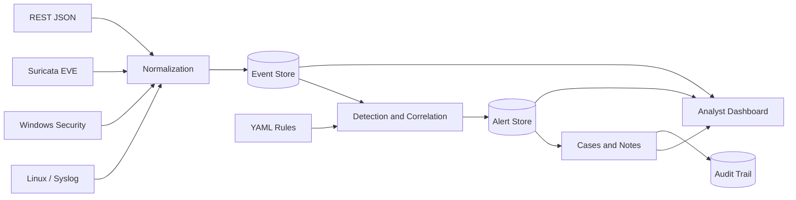

# Stage 2CS SIEM

An educational Security Information and Event Management platform built for a first-year cybersecurity internship at ESI. It collects heterogeneous security telemetry, normalizes it, correlates suspicious activity, maps alerts to MITRE ATT&CK, and gives analysts a workflow for investigating incidents.

Repository: [github.com/4ym3nn/stage-2cs-siem](https://github.com/4ym3nn/stage-2cs-siem)

## Why this project exists

Stage 2CS SIEM is intentionally small enough to understand from collector to investigation, while demonstrating the main responsibilities of a larger SIEM:

- Collect Linux journal, Windows Security, Suricata EVE, syslog, and generic JSON events.
- Normalize different data sources into a common event model.
- Correlate activity using event timestamps, thresholds, and time windows.
- Aggregate duplicate activity with per-rule cooldown periods.
- Map detections to MITRE ATT&CK techniques and tactics.
- Triage alerts with status, assignee, resolution, notes, and cases.
- Record analyst actions in an audit trail.
- Export alert results to CSV.

This is a lab and internship project, not a replacement for Elastic Security, Splunk, Microsoft Sentinel, or Wazuh.

## Detection coverage

Detection metadata and tuning values live in [`config/detection_rules.yml`](config/detection_rules.yml), separate from the Python engine.

| Rule | Detection | Severity | MITRE ATT&CK |
|---|---|---:|---|
| `LINUX-SSH-BRUTE` | SSH brute-force burst | High | T1110 |
| `AUTH-FAIL-BURST` | Authentication failure burst | Medium | T1110 |
| `NET-PORT-SCAN` | Multi-port network scan | Medium | T1046 |
| `PRIV-SUDO-ROOT` | Privileged Linux command execution | Medium | T1548.003 |
| `WIN-PRIV-GROUP` | Addition to a Windows privileged group | High | T1098 |
| `PROC-REVERSE-SHELL` | Common reverse-shell behavior | Critical | T1059 |
| `WEB-ENUM` | Automated web enumeration | Medium | T1595.002 |
| `SURICATA-HIGH` | High-severity Suricata alert | High | Contextual |
| `WIN-ACCOUNT-CREATED` | Windows account creation | Medium | T1136.001 |
| `WIN-POWERSHELL-ENCODED` | Encoded PowerShell execution | High | T1059.001 |
| `WIN-LOG-CLEARED` | Windows audit log cleared | High | T1070.001 |
| `LINUX-PERSIST-CRON` | Linux cron modification | Medium | T1053.003 |
| `LINUX-LOG-CLEARED` | Linux log removal or truncation | High | T1070.002 |

## Architecture



See [Architecture](docs/ARCHITECTURE.md) for the data flow and trust boundaries.

## Quick start with Docker

```bash
cp .env.example .env
docker compose up --build -d
```

Open:

- Dashboard: <http://127.0.0.1:8000>
- OpenAPI: <http://127.0.0.1:8000/docs>
- Health: <http://127.0.0.1:8000/health>

Load the safe demonstration telemetry:

```bash
python3 scripts/generate_demo.py
```

## Local development

Python 3.11 or later is recommended.

```bash
python3 -m venv .venv
source .venv/bin/activate
pip install -r requirements.txt
uvicorn app.main:app --reload
```

In a second terminal:

```bash
source .venv/bin/activate
python scripts/generate_demo.py
```

## Analyst workflow

1. Open **Alerts** and select a detection.
2. Review the latest related event and structured evidence.
3. Set the alert to `investigating` and assign an analyst.
4. Add investigation notes.
5. Create a case directly from the alert.
6. Close or classify the alert and record the reason.
7. Export alerts as CSV when evidence is needed for a report.

The API offers the same workflow through `/api/alerts`, `/api/cases`, and `/api/audit`.

## API examples

Ingest one normalized event:

```bash
curl -X POST http://127.0.0.1:8000/api/events \
  -H 'Content-Type: application/json' \
  -d '{
    "source":"linux",
    "host":"web-01",
    "event_type":"process",
    "user":"www-data",
    "message":"suspicious process observed"
  }'
```

Ingest source-native samples:

```bash
curl -X POST http://127.0.0.1:8000/api/ingest/linux -H 'Content-Type: application/json' -d @samples/linux.json
curl -X POST http://127.0.0.1:8000/api/ingest/windows -H 'Content-Type: application/json' -d @samples/windows.json
curl -X POST http://127.0.0.1:8000/api/ingest/suricata -H 'Content-Type: application/json' -d @samples/suricata-eve.json
```

Triage an alert:

```bash
curl -X PATCH http://127.0.0.1:8000/api/alerts/1 \
  -H 'Content-Type: application/json' \
  -H 'X-Analyst: aymen' \
  -d '{"status":"investigating","assignee":"aymen"}'
```

## Collectors

Replay or follow Suricata EVE JSON:

```bash
python scripts/ship_suricata_eve.py /var/log/suricata/eve.json
python scripts/ship_suricata_eve.py /var/log/suricata/eve.json --follow
```

Follow the Linux system journal:

```bash
python scripts/linux_journal_forwarder.py
python scripts/linux_journal_forwarder.py --unit ssh.service
```

Forward selected Windows Security events from an authorized Windows host:

```powershell
PowerShell -ExecutionPolicy Bypass -File .\scripts\windows_forwarder.ps1 -SiemUrl http://SIEM-IP:8000
```

Run the lab UDP syslog collector on port 5514:

```bash
SYSLOG_BIND=0.0.0.0 SYSLOG_PORT=5514 SIEM_URL=http://127.0.0.1:8000 python scripts/syslog_udp.py
```

The UDP collector is deliberately minimal and must not be exposed to an untrusted network.

## API keys and roles

Local development works without a key. Shared deployments can use separate keys:

```dotenv
SIEM_INGEST_API_KEY=collector-secret
SIEM_ANALYST_API_KEY=analyst-secret
SIEM_ADMIN_API_KEY=administrator-secret
SIEM_PROTECT_READS=true
```

`SIEM_API_KEY` grants all three roles and is convenient for a small lab. Send a key in the `X-API-Key` header. The dashboard's **API key** button stores it only in the browser session.

Place shared deployments behind TLS and an authenticated reverse proxy. See [Security](SECURITY.md).

## Retention

Events are retained for 30 days by default:

```bash
export SIEM_RETENTION_DAYS=14
curl -X POST http://127.0.0.1:8000/api/admin/cleanup
```

Alert notes are removed before their retained events and alerts. The cleanup action is recorded in the audit trail.

## Tests

```bash
pytest -q
```

The suite covers API health, ingestion, event-time correlation, alert aggregation, API-key enforcement, source-specific detections, case management, analyst notes, audit logging, CSV export, and request-size limits.

## Project structure

```text
.
├── app/
│   ├── main.py                  # REST API and analyst workflows
│   ├── detections.py            # Detection and correlation engine
│   ├── models.py                # Events, alerts, cases, notes, audit records
│   ├── normalizers.py           # Linux, Windows, and Suricata mapping
│   ├── security.py              # Role-aware API-key gates
│   └── static/                  # SOC dashboard
├── config/detection_rules.yml  # Rule metadata and tuning
├── scripts/                     # Collectors and demo generator
├── samples/                     # Example source events
├── tests/                       # Automated tests
├── docs/                        # Architecture and demo guide
├── Dockerfile
└── docker-compose.yml
```

## Internship demonstration

Use the reproducible walkthrough in [docs/DEMO.md](docs/DEMO.md). It connects each safe simulated action to its log source, normalized event, rule, ATT&CK mapping, alert, and analyst response.

Use only telemetry and systems you own or are explicitly authorized to monitor.

## License

MIT
