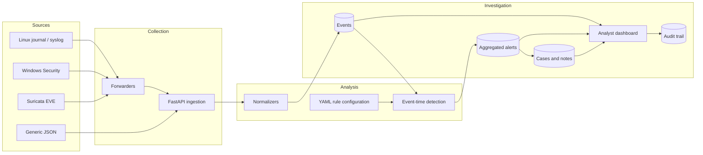
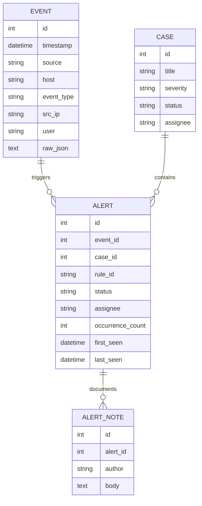

# Architecture

## Data flow

## Processing pipeline

1. **Collection**: authorized telemetry arrives through REST, the Suricata shipper, the journal forwarder, the Windows forwarder, or the lab UDP syslog collector.
2. **Validation**: Pydantic limits the main event fields and bulk requests are rejected above 5,000 records.
3. **Normalization**: source-specific values become a common event containing timestamp, source, host, event type, severity, addresses, user, message, and raw JSON.
4. **Storage**: the normalized event is committed to the configured SQLAlchemy database.
5. **Detection**: deterministic logic evaluates the event and queries earlier events relative to the event's own timestamp. This keeps chronological log replay meaningful.
6. **Aggregation**: detections with the same rule and entity scope are merged during their configured cooldown. The alert records first seen, last seen, and occurrence count.
7. **Investigation**: an analyst can assign alerts, change state, explain a resolution, add notes, and group alerts into cases.
8. **Accountability**: alert changes, notes, case changes, and retention cleanup create audit records.

## Data model

## Trust boundaries

- Collectors are untrusted data producers. Their writes can require an ingestion key.
- Analysts can modify alerts, add notes, and manage cases using an analyst key.
- Administrators can run retention cleanup and read the audit trail using an administrator key.
- Read endpoints are open for local demonstrations by default and can be protected using `SIEM_PROTECT_READS=true`.
- Raw logs may contain sensitive data. Shared deployments require TLS, access control, backups, and a defined retention policy.

## Storage choices

SQLite is the default because it keeps the internship lab reproducible. `SIEM_DB_URL` accepts another SQLAlchemy database URL, allowing PostgreSQL to be introduced when concurrency or data volume justifies it. SQLite compatibility upgrades preserve databases created by the first version.

## Intended scope

The system demonstrates SIEM engineering and SOC workflow fundamentals. It does not claim production-scale ingestion, high availability, full identity management, or hostile-network hardening.
